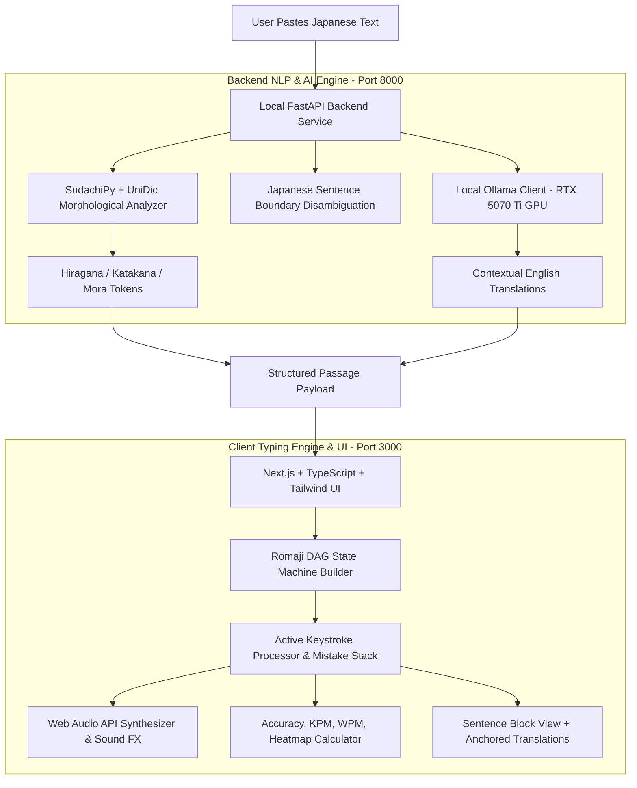

# Japanese Language & English Touch-Typing App (Architecture & Design Plan)

A dual-purpose application designed to master Japanese reading comprehension and English touch typing simultaneously. The user pastes Japanese text, which is parsed with morphological precision into Hiragana/Katakana and translated into English. The user touch-types the passage using an English keyboard via an advanced Romaji DAG (Directed Acyclic Graph) engine that hides Romaji hints, handles all input variations, supports mistake buffering and backspacing, and provides detailed typing metrics.

---

## 1. System Architecture Overview



---

## 2. Tech Stack Selection

| Layer | Technology | Rationale |
| :--- | :--- | :--- |
| **Frontend Framework** | **Next.js 14+ (App Router) + TypeScript** | React 18+ concurrent rendering, ultra-low latency event loop for 120Hz/240Hz typing input. |
| **Styling & Icons** | **Tailwind CSS + Lucide React** | Sleek, modern Monkeytype-inspired dark/light theme with zero layout shift. |
| **Morphological Parser** | **Python + SudachiPy (`sudachidict_core`)** | Modern industry gold-standard; eliminates inaccuracies of older IPADIC/Kuromoji parsers (correct particles, compound verbs, and readings). |
| **Local Translation** | **Ollama (`qwen2.5:7b` or `qwen2.5:14b`) on RTX 5070 Ti** | 80–120+ tokens/sec local inference, zero API cost, full privacy, high contextual translation quality. |
| **Audio System** | **Web Audio API (Custom Synth / AudioBuffers)** | Zero-latency mechanical key clicks, error thuds, and sentence completion chimes. |
| **Persistence** | **LocalStorage / IndexedDB** | Stores settings, audio preferences, and typing performance history without external database dependencies. |

---

## 3. Core Engine: Romaji DAG & Typing State Machine

### 3.1 Why a Directed Acyclic Graph (DAG)?
In Japanese typing, a single Kana sequence can have dozens of valid keystroke combinations:
* **Variants**: `し` $\rightarrow$ `shi`, `si`, `ci`; `つ` $\rightarrow$ `tsu`, `tu`; `じ` $\rightarrow$ `ji`, `zi`.
* **Contracted Sounds (Yōon)**: `しゃ` $\rightarrow$ `sha`, `sya`, `sixya`, `silya`, `cya`.
* **Sokuon (Small っ)**: `っか` $\rightarrow$ double consonant `kka`, or separate `xtuka` / `ltuka`.
* **Hatsuon (ん)**: `ん` $\rightarrow$ `nn`, `xn`, or single `n` (if followed by consonants other than `n`, `y`, vowels).

### 3.2 DAG Node Structure (TypeScript)
```typescript
interface DAGNode {
  id: string;
  char: string;              // Expected English key, e.g., 's', 'h', 'i'
  kanaIndex: number;         // Index of Japanese character in the active sentence
  moraIndex: number;         // Token group index
  isTerminalKana: boolean;   // True if this node completes a Japanese character/mora
  next: DAGNode[];           // Outgoing valid edges
}

interface TypingState {
  currentNodes: DAGNode[];   // Active candidate nodes in the DAG
  mistakeStack: string[];    // Buffered incorrect keystrokes
  kanaCursor: number;        // Current Japanese character position
  sentenceIndex: number;     // Active sentence
  correctKeystrokes: number;
  incorrectKeystrokes: number;
  totalKeystrokes: number;
  startTime: number | null;
}
```

### 3.3 No-Romaji Display & Mistake/Backspace Flow
1. **Visual State**: Only the Japanese sentence is displayed (in Original, Hiragana, or Katakana mode). Romaji letters are **never** shown in advance.
2. **Key Input Validation**:
   * User types an English key $K$:
   * **Case A: Valid Keystroke**: If $K$ matches any child in `currentNodes`:
     * If `mistakeStack` is empty:
       * Advance `currentNodes` to matching children.
       * Increment `correctKeystrokes`.
       * Play mechanical key sound.
       * If node has `isTerminalKana`, advance the active Japanese character highlight!
   * **Case B: Mistake Keystroke**: If $K$ does not match any valid branch:
     * Push $K$ onto `mistakeStack`.
     * Increment `incorrectKeystrokes`.
     * Play error sound.
     * Highlight active Japanese character in **red shake/error state**.
     * Lock forward progression until resolved.
   * **Case C: Backspace**:
     * If `mistakeStack.length > 0`:
       * Pop mistake from stack.
       * If stack becomes empty, remove red error highlight and restore active cursor!
     * If `mistakeStack` is already empty, allow backspacing into previous Kana (optional setting).

---

## 4. Statistics & Accuracy Engine

### 4.1 Formulas
* **Accuracy (%)**:
  $$\text{Accuracy} = \left(\frac{\text{Correct Keystrokes}}{\text{Total Keystrokes Made}}\right) \times 100$$
  *(Where Total Keystrokes = Correct + Incorrect/Typos + Backspaces used to fix errors).*
* **KPM (Keystrokes Per Minute)**:
  $$\text{KPM} = \frac{\text{Correct Keystrokes}}{\text{Time Elapsed in Minutes}}$$
* **WPM (Words Per Minute)**:
  $$\text{WPM} = \frac{\text{KPM}}{5}$$
* **CPM (Characters Per Minute)**:
  $$\text{CPM} = \frac{\text{Japanese Mora Completed}}{\text{Time Elapsed in Minutes}}$$
* **Kana Error Breakdown**:
  * Records a dictionary of `{ [kana: string]: { attempts: number, errors: number } }` to display a weakness report at the end of the test.

---

## 5. UI Layout & Visual Specifications

### 5.1 Component Hierarchy
```
AppLayout
├── TopNavigationBar
│   ├── ScriptToggle: [ Original (漢字) | ひらがな | カタカナ ]
│   ├── TranslationToggle: [ 👁 Show / Hide English ]
│   ├── AudioSettingsPopover: (Individual toggles & volume sliders)
│   └── LiveMetricsBar: [ KPM | WPM | Accuracy | Progress ]
├── PassageWorkspace
│   ├── InputModal / PasteDrawer (for new passage entry)
│   └── SentenceStream (Vertical block container)
│       └── SentenceBlock (repeated per sentence)
│           ├── EnglishTranslationBar (Anchored top, grey-400, left-aligned)
│           └── JapaneseSentenceLine
│               ├── CompletedKana (Muted green / primary accent)
│               ├── ActiveKana (Bright white, underlined, with caret indicator)
│               └── UpcomingKana (Darker muted slate/gray)
└── ResultsModal (Triggered on passage completion)
    ├── Summary Cards (KPM, WPM, Accuracy, Time)
    ├── Speed & Error Graph over Time
    └── Kana Accuracy Heatmap (Struggled characters)
```

### 5.2 Dynamic Script Switching
* Switching between **Original (Kanji/mixed) $\leftrightarrow$ Hiragana $\leftrightarrow$ Katakana** is allowed at **any millisecond** during typing.
* Because the backend provides aligned character mappings (Kanji $\leftrightarrow$ Reading range), switching script simply rerenders the display strings while the DAG index maps smoothly to the corresponding character position.

### 5.3 Sentence Alignment Logic
* Each sentence block sits in its own flex container with fixed left-padding.
* The English translation is rendered as a sub-header directly above the Japanese text:
  * Font: `text-sm font-medium text-slate-400 tracking-wide`
  * Japanese text: `text-2xl font-japanese font-semibold leading-relaxed tracking-wider`
  * Ensures the first word of the English sentence shares the exact same horizontal coordinate as the first Japanese character.

---

## 6. Sound System Specifications

Using Web Audio API with synthetically generated sounds or preloaded high-fidelity audio buffers:

| Sound Event | Description | Configurable Settings |
| :--- | :--- | :--- |
| **Keystroke** | Mechanical switch click (options: Blue Clicky, Brown Tactile, Thock) | Enabled (Y/N), Volume (0–100%), Switch Profile |
| **Mistake / Error** | Muted low-frequency thud or buzz | Enabled (Y/N), Volume (0–100%) |
| **Sentence Finish** | Soft uplifting bell chime | Enabled (Y/N), Volume (0–100%) |
| **Passage Victory** | Celebratory progression chord | Enabled (Y/N), Volume (0–100%) |

---

## 7. Local Backend & NLP Pipeline (Python + FastAPI)

### 7.1 Backend Endpoints
* `POST /api/process-passage`:
  * **Input**: `{ "text": "吾輩は猫である。名前はまだ無い。" }`
  * **Processing**:
    1. **Sentence Boundary Detection**: Splits text cleanly into sentences using punctuation rules (`。`, `！`, `？`).
    2. **SudachiPy Morphological Analysis**: Extracts readings, converts to Hiragana and Katakana representations, and flags token boundaries.
    3. **Ollama Local Translation (RTX 5070 Ti)**:
       * Model: `qwen2.5:7b` (or `qwen2.5:14b`).
       * Prompt: High-precision sentence-by-sentence translation prompt enforcing direct 1:1 array output.
  * **Output**:
    ```json
    {
      "sentences": [
        {
          "id": 1,
          "original": "吾輩は猫である。",
          "hiragana": "わがはいはねこである。",
          "katakana": "ワガハイハネコデアル。",
          "translation": "I am a cat."
        },
        {
          "id": 2,
          "original": "名前はまだ無い。",
          "hiragana": "なまえはまだない。",
          "katakana": "ナマエハマダナイ。",
          "translation": "As of yet, I have no name."
        }
      ]
    }
    ```

* `GET /api/health`: Verifies SudachiPy and Ollama GPU status.

---

## 8. Verification & Testing Plan

1. **DAG Romaji Correctness**:
   * Unit tests covering all tricky edge cases:
     * `し` (`shi`, `si`, `ci`)
     * `っち` (`tchi`, `tti`, `cchi`, `xtu-chi`)
     * `ん` before vowels (`den'en` $\rightarrow$ `dennen` vs `んあ`)
     * Small kana variations (`きゃ` $\rightarrow$ `kya`, `kilya`, `kixya`).
2. **Mistake & Backspace Integrity**:
   * Test typing incorrect character $\rightarrow$ verify cursor locks and turns red.
   * Test pressing Backspace $\rightarrow$ verify mistake pops and typing can resume.
3. **Dynamic Script Switch Test**:
   * Type half of sentence 1 in Kanji $\rightarrow$ toggle to Hiragana $\rightarrow$ verify progress remains intact and next keystroke matches expected Hiragana mora.
4. **Sentence Anchor UI Verification**:
   * Verify English translation line aligns with the initial Japanese character at all viewport sizes.
5. **GPU Inference Latency Check**:
   * Benchmark Ollama translation on RTX 5070 Ti for a 500-word passage to verify it processes in < 2 seconds.
